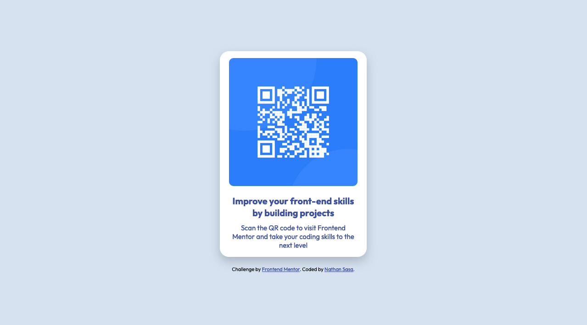

# Frontend Mentor - QR code component solution

This is a solution to the [QR code component challenge on Frontend Mentor](https://www.frontendmentor.io/challenges/qr-code-component-iux_sIO_H). Frontend Mentor challenges help you improve your coding skills by building realistic projects. 

## Table of contents

- [Overview](#overview)
  - [Screenshot](#screenshot)
  - [Links](#links)
- [My process](#my-process)
  - [Built with](#built-with)
  - [What I learned](#what-i-learned)
  - [Continued development](#continued-development)
  - [Useful resources](#useful-resources)
- [Author](#author)
- [Acknowledgments](#acknowledgments)

**Note: Delete this note and update the table of contents based on what sections you keep.**

## Overview

### Screenshot

### Links

- Solution URL: [Add solution URL here](https://github.com/Nathan-Sasa/fr-mentor-qr-code.git)
- Live Site URL: [Add live site URL here](https://nathan-sasa.github.io/fr-mentor-qr-code/)

## My process

### Built with

- Semantic HTML5 markup
- CSS custom properties
- Flexbox
- Mobile-first workflow

### Useful resources

I didn't use external resources, I made this project based on my own knowledge.

## Author

- Website - [nathan sasa](https://github.com/Nathan-Sasa)
- Frontend Mentor - [@Nathan](https://www.frontendmentor.io/profile/nathan)
- Twitter - [@S_Nathan001](https://www.x.com/s_nathan001?s=21)
